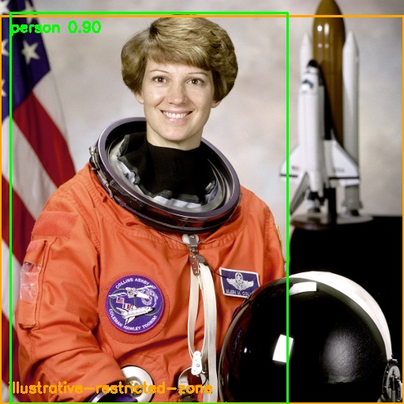
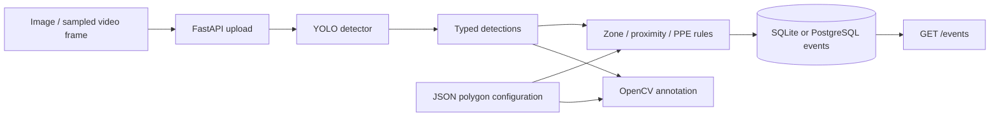

# Warehouse Safety Vision

Connect YOLO person detection to configurable zone rules, annotated frames, and persisted safety events.



   
[](https://github.com/faizansahi/warehouse-safety-vision/actions/workflows/ci.yml)

## Overview

A computer vision backend that separates model inference from safety policy. A FastAPI endpoint analyzes images; a video client submits sampled frames and saves annotations.

## Business Problem

A detector's bounding boxes alone do not describe a policy violation or provide a queryable event history.

## Solution

Translate typed detections into polygon-zone and proximity rules, store events with SQLAlchemy, and return both structured results and an annotated image.

## Key Features

- Actual Ultralytics YOLO inference with class labels and confidence values.
- Configured restricted and pedestrian-only polygons, drawn on output frames.
- Person-zone, forklift-zone, proximity, and explicit no-helmet rules.
- Bounded image uploads, cached serialized inference, and safe model-failure responses.
- Persisted event API, Alembic migrations, and a video-frame client.

## Architecture



[Architecture details](docs/architecture.md) · [Engineering decisions](docs/decisions.md)

## Technology Stack

Python 3.12, FastAPI, Ultralytics YOLO11n, PyTorch, OpenCV, NumPy, SQLAlchemy, PostgreSQL/SQLite, Alembic, Docker Compose, Pytest, Ruff, and GitHub Actions.

## Demo / Results

The actual YOLO11n model detected **1 person with confidence 0.899** in a NASA public-domain portrait. A deliberately illustrative zone covering that person's foot point generated **1 HIGH PERSON_IN_RESTRICTED_ZONE event**, confirmed through the event API. Boxes come from model output; the orange polygon is configuration. This sample demonstrates the workflow and does not measure warehouse detection quality.

[Actual output](docs/results/demo.json) · [PostgreSQL container results](docs/results/docker-demo.json) · [Test report](docs/results/tests.txt) · [Provenance](docs/results/provenance.md) · [Verification status](docs/results/verification.md)

Reproduce using a fresh local database and a running API:

```bash
python scripts/demo_frame.py
```

Set `ZONES_FILE=config/zones.demo.json` before starting the API to reproduce the illustrated event. See [sample attribution](THIRD_PARTY_NOTICES.md).

## Installation

Requires Python 3.12+. From this repository:

```bash
python -m venv .venv
# Linux/macOS: source .venv/bin/activate
# Windows PowerShell: .venv\Scripts\Activate.ps1
python -m pip install -e ".[dev]"
uvicorn warehouse_vision.main:app --reload
```

Open `http://localhost:8000/docs`. With no environment file, the API uses SQLite. See [setup](docs/setup.md).

## Docker Setup

Copy `.env.example` to `.env`, set a unique URL-safe `POSTGRES_PASSWORD`, then run:

```bash
docker compose up --build
```

Compose supplies PostgreSQL and persistent storage. The API binds to localhost port 8000; run one project's stack at a time. Docker was unavailable on the local Windows review machine; [verification status](docs/results/verification.md) records separate container checks.

## Environment Variables

| Variable | Default / requirement | Purpose |
|---|---|---|
| `DATABASE_URL` | `sqlite:///./safety.db` | Event database |
| `YOLO_WEIGHTS` | `yolo11n.pt` | Standard or custom model path |
| `CONFIDENCE_THRESHOLD` | `0.4` | Detection cutoff |
| `PROXIMITY_PIXELS` | `120` | Image-plane rule threshold |
| `ZONES_FILE` | `config/zones.example.json` | Polygon configuration |
| `POSTGRES_PASSWORD` | Required for Compose | Local database password |

The app reads `.env`. Compose overrides the database URL with its internal PostgreSQL address. Keep real values out of Git.

## API Usage

Use Swagger or the following examples:

```bash
curl -X POST http://localhost:8000/analyze/frame -F "file=@docs/images/sample.png"
curl http://localhost:8000/events
```

[API / data contracts](docs/api.md).

## Tests

```bash
ruff format --check .
ruff check .
pytest --cov=warehouse_vision --cov-report=term-missing
python -m pip check
```

The recorded Windows run passed **7 tests** with **87% statement coverage**. Coverage describes this suite, not complete correctness. API tests explicitly stub the detector; real inference evidence is saved separately. GitHub Actions runs quality and container checks; its badge reports the current status.

## Project Structure

```text
src/warehouse_vision/     Application and domain logic
tests/                  Unit and integration tests
scripts/                Reproducible demos and clients
docs/                   Architecture, setup, API, decisions
docs/images/            Real screenshots and output visuals
docs/results/           Execution and test evidence
.github/workflows/      Automated checks
```

## Engineering Decisions

Keep model output separate from pure geometry rules so rule tests need no weights. Reuse one detector and serialize calls. Interpret bounding-box maximum coordinates as exclusive when finding a foot point. Store safe error categories rather than internal exception text.

## Limitations

COCO weights do not supply forklift or PPE classes; those rules require validated custom weights. A portrait is not an industrial test dataset. Pixel proximity is perspective-dependent. There is no tracking, event deduplication, calibrated distance, authentication, or safety certification. Repeated video frames may produce repeated events. The detector is exercised by the separate real demo, not by unit-test model mocks.

## Future Improvements

Use a licensed warehouse dataset, evaluate custom forklift/PPE models, add tracking and event deduplication, and calibrate camera geometry for robotics or industrial inspection experiments.

## Skills Demonstrated

Python, Computer Vision, Machine Learning integration, OpenCV, PyTorch, YOLO, Backend Development, REST API, SQL, geometric rules, Docker, Git, Pytest, and CI/CD checks.

## Relevance for German Werkstudent Roles

Relevant to Werkstudent Computer Vision, AI, and robotics-adjacent software roles: it demonstrates inference integration, geometry, event persistence, and clear model limitations.
