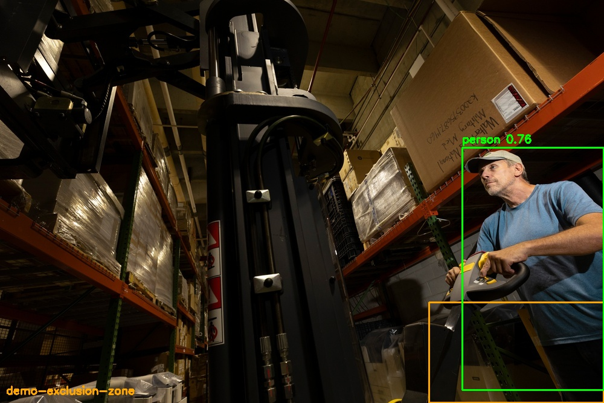
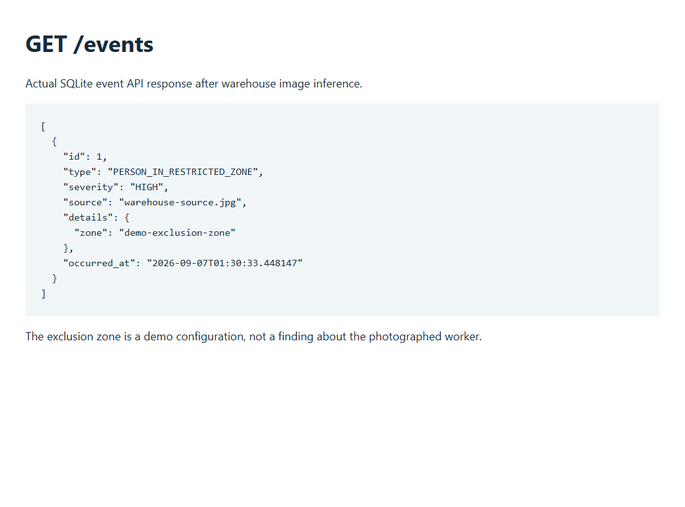

# Warehouse Safety Vision

Run YOLO person detection on images, evaluate configured safety zones, and store the resulting events in a queryable API.

Green boxes come from YOLO11n. The orange polygon is a configured demo exclusion
zone. This warehouse photograph produced a person detection and a
`PERSON_IN_RESTRICTED_ZONE` event, read back from the event database.
The zone is illustrative; it is not a judgment about the photographed worker's safety.

Photo: Ricardo J. Reyes / DVIDS, public domain.
[Source and attribution](THIRD_PARTY_NOTICES.md).
The appearance of U.S. Department of War (DoW) visual information does not imply or constitute DoW endorsement.

## Detector and rules are separate

~~~mermaid
flowchart LR
  Frame[Image / sampled video frame] --> YOLO[YOLO inference]
  YOLO --> Rules[Polygon and proximity rules]
  Config[Zone JSON] --> Rules
  Rules --> DB[(Safety events)]
  DB --> API[GET /events]
  YOLO --> Image[OpenCV annotation]
  Config --> Image
~~~

The detector returns labels, confidence values, and boxes. The rule engine uses
those values without inventing classes:

- A person's box-bottom midpoint is tested against restricted polygons.
- Forklift/pedestrian-zone and no-helmet rules require custom weights that actually
  return the corresponding labels.
- Person–forklift proximity uses Euclidean distance between box centers in pixels.
  It is not distance in metres and changes with camera perspective.

The default COCO model supports person detection but does **not** provide forklift
or PPE classes. Equipment appearing in the photo is not evidence of equipment detection.
The [unmodified model annotation](docs/images/person-detection.jpg) shows the detected class.

## Run inference

Create and activate a Python 3.12+ virtual environment, then:

~~~bash
python -m pip install -e ".[dev]"
uvicorn warehouse_vision.main:app --reload
~~~

The first inference downloads YOLO11n weights. For the saved demo, set
`ZONES_FILE=config/zones.demo.json` in `.env` before starting the API.

~~~bash
python scripts/demo_frame.py
curl http://localhost:8000/events
~~~

The demo submits the attributed warehouse photo to `POST /analyze/frame`, saves
the returned annotation, and checks the persisted event.
[Actual detections and events](docs/results/demo.json) include the input SHA-256.

The API accepts image files up to 10 MB and returns a base64 JPEG alongside structured
detections and events. A video client samples frames:

~~~bash
python scripts/analyze_video.py path/to/sample.mp4 --every 30
~~~

Use footage you have permission to process. Sampled annotations go to ignored `outputs/`.

## Configuration and persistence

`ZONES_FILE` contains named polygons in image pixels; adapt coordinates to the camera's
resolution and viewpoint. `CONFIDENCE_THRESHOLD` defaults to 0.4,
`PROXIMITY_PIXELS` to 120, and `YOLO_WEIGHTS` to `yolo11n.pt`.
SQLite is the local default.

For PostgreSQL, copy `.env.example` to `.env`, set a unique URL-safe
`POSTGRES_PASSWORD`, then run `docker compose up --build`.
Alembic migrations run before the API starts. Model calls are cached and serialized;
failed inference returns 503 and persists a safe system-error event.

Python, Ultralytics/PyTorch, OpenCV, FastAPI, SQLAlchemy, and Alembic are used here.
The integration remains AGPL-3.0 because it uses Ultralytics code and weights;
see [third-party notices](THIRD_PARTY_NOTICES.md).

## Verification and limits

~~~bash
ruff check .
ruff format --check .
pytest --cov=warehouse_vision --cov-report=term-missing
python -m pip check
~~~

Unit tests use explicit detector stubs to exercise geometry and API behavior.
The committed photo demo and the PostgreSQL container check run actual YOLO inference.
[Test output](docs/results/tests.txt) and [CI/container evidence](docs/results/verification.md)
record those checks separately.

One warehouse image is not a detection benchmark. Partial or occluded people can
make a box-bottom point a poor foot estimate. There is no tracking, event deduplication,
camera calibration, authentication, or safety certification. Repeated frames can
create repeated alerts. Tracking and calibrated geometry are the next useful additions.

[API](docs/api.md) · [Setup](docs/setup.md) · [Rule decisions](docs/decisions.md)
