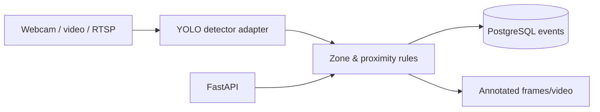

# Warehouse Safety Vision

Computer-vision backend for configurable safety zones, event rules, persisted incident history, and annotated inspection output. Detection is separated from safety policy so custom warehouse models can replace general-purpose YOLO weights safely.



## Safety capabilities

- Polygon restricted and pedestrian-only zones
- `PERSON_IN_RESTRICTED_ZONE`, `FORKLIFT_IN_PEDESTRIAN_ZONE`, `PERSON_FORKLIFT_PROXIMITY`, `PPE_VIOLATION`, and `SYSTEM_ERROR` domain contract
- LOW/MEDIUM/HIGH severity, confidence threshold, event history, frame annotation
- Webcam/file/RTSP-compatible OpenCV source design
- Custom YOLO weight adapter for forklift and PPE classes

## Run

```bash
pip install -e ".[dev]"
uvicorn warehouse_vision.main:app --reload
pytest --cov=warehouse_vision
docker compose up --build
```

Upload an image through `/docs` at `POST /analyze/frame`; query `GET /events`. Configure values using `.env.example`.

## Model honesty and safety limitations

Standard COCO YOLO weights reliably expose `person` but do **not** provide trustworthy forklift, helmet, or no-helmet classes. The application therefore does not relabel cars as forklifts or fabricate PPE results. Supply custom weights whose labels include `forklift`, `industrial_vehicle`, `helmet`, or `no_helmet`. Train from reviewed warehouse/PPE annotations, validate per-site, then set `YOLO_WEIGHTS`.

Pixel distance is an image-plane approximation affected by perspective. Calibrated cameras, homography, tracking, and real-world distance estimation are required before operational safety use. This is a decision-support portfolio system, not a certified safety device.

## Skills Demonstrated

Python, Computer Vision, OpenCV, PyTorch, Ultralytics YOLO, FastAPI, PostgreSQL, SQLAlchemy, Docker, REST APIs, event-driven rules, Pytest, Git, Linux, and CI/CD.

## Relevance for German Werkstudent Roles

- Connects ML inference to testable software-engineering rules.
- Handles honest model limitations and operational risk explicitly.
- Demonstrates geometry, API development, persistence, and observability.
- Provides a clean path from pretrained to custom industrial models.
