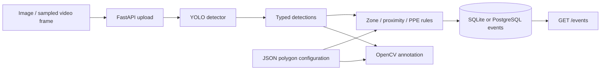

# Architecture

Translate typed detections into polygon-zone and proximity rules, store events with SQLAlchemy, and return both structured results and an annotated image.

Keep model output separate from pure geometry rules so rule tests need no weights. Reuse one detector and serialize calls. Interpret bounding-box maximum coordinates as exclusive when finding a foot point. Store safe error categories rather than internal exception text.

## Execution boundaries

COCO weights do not supply forklift or PPE classes; those rules require validated custom weights. A portrait is not an industrial test dataset. Pixel proximity is perspective-dependent. There is no tracking, event deduplication, calibrated distance, authentication, or safety certification. Repeated video frames may produce repeated events. The detector is exercised by the separate real demo, not by unit-test model mocks.

Tests use disposable SQLite stores. Live demos use public or fictional input. Container checks use a separate PostgreSQL service. See [execution evidence](results/demo.json) and [verification status](results/verification.md).
