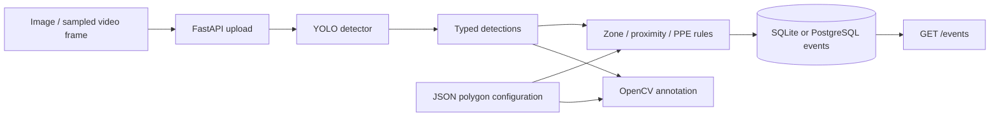

# Architecture

Typed detections feed independent geometry rules and OpenCV annotation. Rules create SQL events. Video processing is a client that submits sampled frames.

See [design decisions](decisions.md) for tradeoffs.
